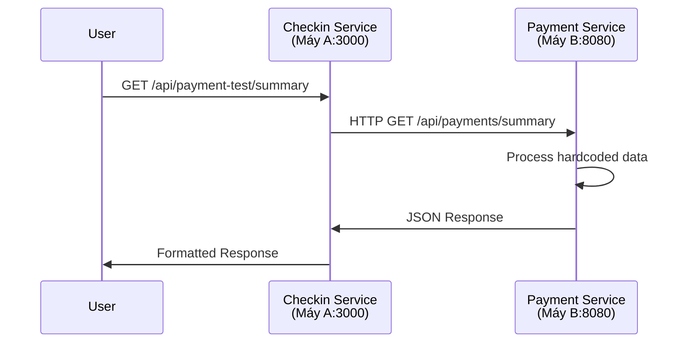

# 🚀 Cross-Machine Microservice Communication Demo

## 📋 Tổng quan
Demo giao tiếp giữa 2 microservices trên 2 máy khác nhau:
- **Máy A (100.72.224.90)**: Checkin Service (Node.js/TypeScript)
- **Máy B (100.122.204.66)**: Payment Service (Spring Boot/Java)

## 🏗️ Kiến trúc hệ thống

```
┌─────────────────┐    HTTP API Call    ┌─────────────────┐
│   Máy A         │ ──────────────────► │   Máy B         │
│ Checkin Service │                     │ Payment Service │
│ (Node.js)       │                     │ (Spring Boot)   │
│ Port: 3000      │                     │ Port: 8080      │
└─────────────────┘                     └─────────────────┘
```

## 🔧 Setup trên Máy B (Payment Service)

### 1. Yêu cầu hệ thống
- Java 17+
- Maven 3.6+
- Tailscale (để kết nối cross-machine)

### 2. Cài đặt
```bash
# 1. Copy folder "Eventix features" từ máy A
# 2. Di chuyển vào thư mục
cd "Eventix features/Eventix"

# 3. Build project
mvn clean package -DskipTests

# 4. Chạy Payment Service
java -jar target/Eventix-0.0.1-SNAPSHOT.jar
```

### 3. Kiểm tra service đã chạy
```bash
# Kiểm tra port 8080 đang listen
netstat -an | findstr :8080

# Test local trên máy B
curl http://localhost:8080/api/payments/health
```

### 4. Mở firewall (nếu cần)
```bash
# Windows Firewall
netsh advfirewall firewall add rule name="Payment Service" dir=in action=allow protocol=TCP localport=8080

# Hoặc tắt Windows Firewall tạm thời để test
```

## 🌐 Setup trên Máy A (Checkin Service)

### 1. Cấu hình IP máy B
File: `Eventix/checkin-service/src/infrastructure/external/PaymentServiceRepository.ts`
```typescript
const baseUrl = 'http://100.122.204.66:8080/api/payments';
```

### 2. Cấu hình Docker
File: `Eventix/checkin-service/docker-compose.yml`
```yaml
environment:
  - PAYMENT_SERVICE_URL=http://100.122.204.66:8080/api/payments
```

### 3. Chạy Checkin Service
```bash
cd Eventix/checkin-service
docker-compose up -d
```

## 🎯 Endpoints để Demo

### Payment Service (Máy B - Port 8080)

#### 1. Health Check
```bash
# Từ máy B (local)
curl http://localhost:8080/api/payments/health

# Từ máy A (cross-machine)
curl http://100.122.204.66:8080/api/payments/health
```
**Response:** `"Payment Service is running! Cross-machine demo ready 🚀"`

#### 2. Danh sách Payments
```bash
# Từ máy A
curl http://100.122.204.66:8080/api/payments
```
**Response:**
```json
[
  {"amount":100000,"method":"BANK_TRANSFER","id":1,"status":"SUCCESS"},
  {"amount":150000,"method":"MOMO","id":2,"status":"SUCCESS"}
]
```

#### 3. Payment Summary
```bash
# Từ máy A
curl http://100.122.204.66:8080/api/payments/summary
```
**Response:**
```json
{
  "totalAmount":250000.0,
  "totalPayments":2,
  "message":"Cross-machine API call successful!",
  "successfulPayments":2
}
```

### Checkin Service (Máy A - Port 3000)

#### 1. Test Payment Service Connection
```bash
# Test từ Checkin Service gọi Payment Service
curl http://localhost:3000/api/payment-test/health
curl http://localhost:3000/api/payment-test/summary
```

## 🔄 Workflow Giao tiếp Cross-Machine

### 1. Kịch bản Demo
```
1. User truy cập Checkin Service trên máy A
2. Checkin Service gọi API Payment Service trên máy B
3. Payment Service xử lý và trả về dữ liệu
4. Checkin Service nhận response và hiển thị cho user
```

### 2. Chi tiết luồng API Call



### 3. Code Implementation

**Checkin Service gọi Payment Service:**
```typescript
// PaymentServiceRepository.ts
async getPaymentSummary(): Promise<any> {
  const response = await axios.get(`${this.baseUrl}/summary`);
  return response.data;
}
```

**Payment Service trả về data:**
```java
// PaymentApiController.java
@GetMapping("/summary")
public ResponseEntity<Map<String, Object>> getPaymentSummary() {
    Map<String, Object> summary = new HashMap<>();
    summary.put("totalAmount", 250000.0);
    summary.put("totalPayments", 2);
    summary.put("successfulPayments", 2);
    summary.put("message", "Cross-machine API call successful!");
    return ResponseEntity.ok(summary);
}
```

## 🧪 Test Cross-Machine Communication

### 1. Test Step by Step
```bash
# Bước 1: Kiểm tra Payment Service trên máy B
curl http://100.122.204.66:8080/api/payments/health

# Bước 2: Test direct API call từ máy A
curl http://100.122.204.66:8080/api/payments/summary

# Bước 3: Test thông qua Checkin Service
curl http://localhost:3000/api/payment-test/summary

# Bước 4: Test với browser
# Mở browser trên máy A: http://100.122.204.66:8080/api/payments/health
```

### 2. Troubleshooting

#### Lỗi "Connection refused"
```bash
# Kiểm tra service đang chạy
netstat -an | findstr :8080

# Kiểm tra firewall
telnet 100.122.204.66 8080

# Kiểm tra Tailscale connection
ping 100.122.204.66
```

#### Lỗi "Timeout"
```bash
# Tăng timeout trong code
axios.defaults.timeout = 30000;

# Hoặc kiểm tra network latency
ping -t 100.122.204.66
```

## 🎬 Demo Script

### Chuẩn bị Demo
1. **Máy B**: Chạy Payment Service
2. **Máy A**: Chạy Checkin Service
3. **Mở 2 terminals** trên máy A

### Demo Flow
```bash
# Terminal 1: Hiển thị Payment Service logs (máy B)
java -jar target/Eventix-0.0.1-SNAPSHOT.jar

# Terminal 2: Test API calls (máy A)
echo "=== Test 1: Direct API call ==="
curl http://100.122.204.66:8080/api/payments/health

echo "=== Test 2: Get payment data ==="
curl http://100.122.204.66:8080/api/payments/summary

echo "=== Test 3: Through Checkin Service ==="
curl http://localhost:3000/api/payment-test/summary
```

## 📊 Expected Results

### Thành công khi thấy:
- ✅ Payment Service start với message: `"Payment Service ready for cross-machine demo!"`
- ✅ Health check trả về: `"Payment Service is running! Cross-machine demo ready 🚀"`
- ✅ Summary trả về JSON với `totalAmount: 250000.0`
- ✅ Checkin Service có thể gọi được Payment Service

### Logs mong đợi:
```
INFO  --- Tomcat started on port 8080 (http) with context path '/'
INFO  --- Started EventixApplication in 8.452 seconds
🚀 Payment Service ready for cross-machine demo!
```

## 🔗 Network Configuration

### IP Addresses
- **Máy A (Checkin)**: `100.72.224.90`
- **Máy B (Payment)**: `100.122.204.66`

### Ports
- **Checkin Service**: `3000`
- **Payment Service**: `8080`

### Firewall Rules
```bash
# Máy B cần mở port 8080 cho máy A
netsh advfirewall firewall add rule name="Payment API" dir=in action=allow protocol=TCP localport=8080 remoteip=100.72.224.90
```

---

## 🎯 **Demo này chứng minh:**
1. ✅ Cross-machine HTTP API communication
2. ✅ Microservices architecture
3. ✅ Service discovery via IP
4. ✅ JSON data exchange
5. ✅ Error handling và timeout management

**Ready for production deployment! 🚀**
